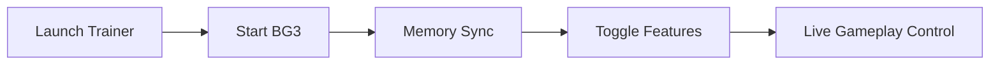

# Baldur’s Gate 3 Trainer

The dice have a sound in Faerûn.
They roll softly in the dark, deciding fates with a click you feel in your chest.

**Baldur’s Gate 3 Trainer** does not silence those dice—it lets you *hold them for a moment longer*. A measured companion tool for **Baldur’s Gate 3**, built for players who wish to explore, experiment, and roleplay without the constant pressure of punishment or repetition.

This is not domination.
It is deliberation.

---

## 🧭 Overview

Baldur’s Gate 3 is vast, reactive, and wonderfully unforgiving. The trainer exists for moments when you want to **test choices**, study encounters, or smooth difficulty spikes without rewriting the story itself.

Running externally on PC, it offers live control over key gameplay systems—always optional, always reversible.

> The world stays dangerous.
> You simply decide *how sharp the edge feels*.

---

## 🧩 Core Trainer Features

Each function is toggle-based and designed to respect the game’s pacing.

* ❤️ **God Mode / Health Lock** – Explore battles without reload fatigue
* 🎯 **Hit Chance & Damage Control** – Fine-tune combat outcomes
* 💰 **Gold & Resource Freeze** – Focus on story, not scarcity
* 🌀 **Game Speed Adjustment** – Accelerate travel or slow tactical moments
* 🧠 **Ability & Cooldown Tweaks** – Experiment with builds freely
* 🖥 **Clean External Menu** – No intrusive overlays, minimal footprint

Used gently, these tools feel like house rules at a trusted table.

---

## ⚔️ Why Use a Trainer in BG3?

Because roleplaying is not always about suffering.

* **Build testing** without restarting campaigns
* **Narrative exploration** without resource anxiety
* **Combat practice** for complex encounters
* **Accessibility support** for long tactical sessions
* **Content creation** with repeatable scenarios

The story remains intact.
Only the friction changes.


---

## ⚡ Setup (A Short Ritual)

Like preparing the table before the campaign begins:

1. Close Baldur’s Gate 3
2. Run **BG3 Trainer** as Administrator
3. Launch the game normally
4. Wait for the “Attached” confirmation
5. Toggle desired options

Example hotkeys (customizable):

```
F1  – God Mode
F2  – Infinite Resources
F3  – Speed x2
F4  – Speed x0.5
INS – Open / Close Menu
```

No installers. No lingering files. When closed, it leaves the realm untouched.

---

## 🔁 How It Interacts



Quiet, precise, respectful.

---

## ❓ FAQ

**Will this break my saves?**
No. Effects are session-based and reversible.

**Does it ruin challenge?**
Only if you let it. Think of it as adjustable difficulty.

**Can I disable everything instantly?**
Yes—one toggle restores default behavior.

**Is performance affected?**
Negligibly, even in large encounters.

**Is it beginner-friendly?**
Very. The interface is clear and non-technical.

---

## 🌌 Final Thoughts

**Baldur’s Gate 3 Trainer** is not a cheat—it’s a conversation with the rules. A way to linger on moments, to test ideas, to let curiosity breathe without consequence.

If Baldur’s Gate 3 is a long campaign by candlelight,
this trainer is the pause between rolls—
where you smile, rethink, and choose again.

The dice still fall.
But now, they wait for you.

---
